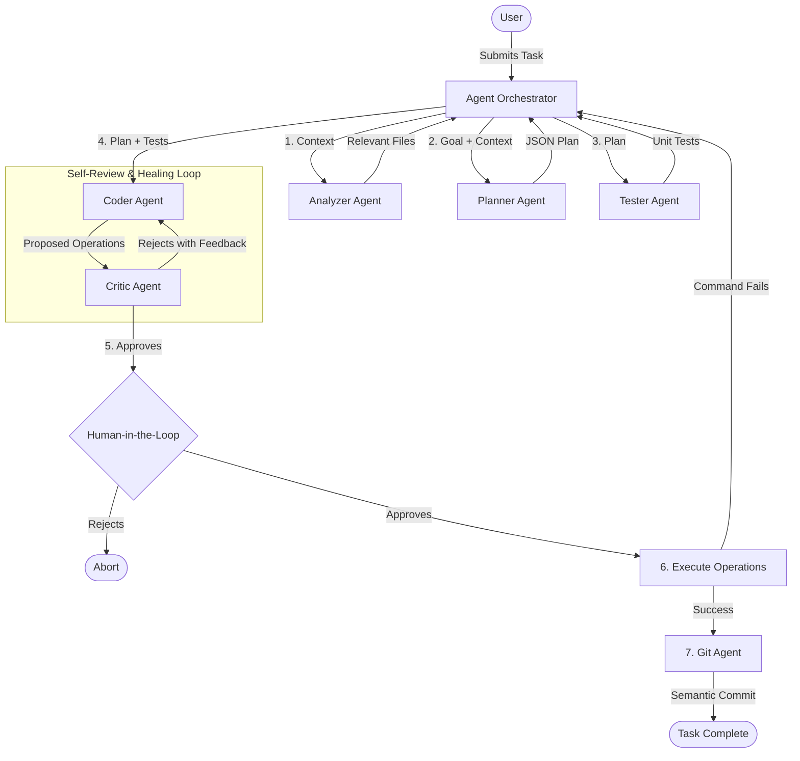

# AI Pair Programming Assistant (VS Code Extension)

An intelligent, highly autonomous VS Code extension that orchestrates an agentic "Write → Refactor → Test" loop, featuring autonomous self-review, workspace context awareness, terminal execution, and semantic auto-commits.

## Motivation
Most AI coding assistants act as passive autocomplete or basic chat interfaces. This project aims to build an **autonomous software engineer agent** (inspired by state-of-the-art tools like Devin, Cursor, and Aider) that integrates deeply into your IDE workflow. Instead of just generating code snippets, it autonomously plans, writes tests, implements code, runs terminal commands, and refactors based on self-feedback, before asking for your final approval.

## 🚀 Key Features

- **Agentic Orchestration (TDD Loop):** The Agent automatically generates a plan, writes unit tests first, and then writes the implementation to pass those tests.
- **Self-Review Loop:** Analyzes code quality and fixes its own mistakes before presenting the code to you.
- **Workspace Context Awareness:** Automatically scans your VS Code workspace, picks the most relevant files, and injects them into the AI's context so it perfectly understands your existing project structure.
- **Terminal Execution:** The agent can run terminal commands autonomously! If it needs a new NPM package or needs to compile code, it will execute the command natively.
- **Self-Healing:** If a terminal command fails (e.g., a compiler error), the agent captures the `stderr`, feeds it back into its own review loop, and rewrites the code to fix the error!
- **Semantic Auto-Commits:** Automatically generates semantic Git commit messages (`feat: ...`, `fix: ...`) and commits the code for you after changes are applied.
- **Integrated Chat UI:** A beautiful VS Code Sidebar Chat interface that streams the agent's real-time thought process and execution logs.
- **Telemetry Tracking:** Built-in SQLite database tracks the quality of AI-generated responses (acceptance rate, tokens used, iterations per task).

## 🛠️ Usage

1. Open the **AI Pair Programming** Chat Sidebar in VS Code (look for the Robot icon).
2. Type in your task, e.g., *"Install lodash and write a utility to sort arrays."*
3. Watch the real-time logs in the chat as the AI:
   - Analyzes your workspace
   - Creates a Plan
   - Writes Tests
   - Implements Code
   - Reviews its own code
   - Decides to run `npm install lodash`
4. Review the final generated operations in the popup.
5. Click **Approve & Apply**. The files will be created, the terminal commands will run, and the changes will be auto-committed via Git!

## Development

- **Build:** Run `npm run compile` to build the TypeScript files.
- **Package:** Run `npx vsce package` to build the `.vsix` extension file.
- **Debug:** Press `F5` in VS Code to launch the Extension Development Host.

## 🏗️ System Architecture

The AI Pair Programming Assistant is built on a **Multi-Agent Orchestration Model**. Instead of a single monolithic LLM prompt, the workload is distributed across specialized "Agents," each handling a specific part of the software development lifecycle.

### The Agentic Loop

When a user submits a task via the Chat UI, the `AgentOrchestrator` coordinates the following sequence:

#### 1. Context Analysis (`AnalyzerAgent`)
- **Role:** Understand the current state of the project.
- **Action:** Scans the VS Code workspace, ignoring standard excluded directories (like `node_modules`). It determines the 3 most relevant files for the current task, reads their contents, and injects them into the prompt to provide the LLM with deep context.

#### 2. Planning (`PlannerAgent`)
- **Role:** Break down the goal into actionable steps.
- **Action:** Receives the user's task and the workspace context. It returns a structured JSON plan consisting of step-by-step instructions (e.g., "Step 1: Define interface", "Step 2: Implement class").

#### 3. Test-Driven Development (`TesterAgent`)
- **Role:** Ensure code reliability.
- **Action:** Before any implementation is written, this agent writes unit tests for the planned steps to define the expected behavior.

#### 4. Implementation (`CoderAgent`)
- **Role:** Write the actual code and execute terminal commands.
- **Action:** Takes the plan and the unit tests, and generates a structured JSON array of operations (`FileOperation`). Operations can include:
  - `write_file`
  - `create_folder`
  - `run_command` (e.g., `npm install`)

#### 5. Review & Self-Healing (`CriticAgent`)
- **Role:** Quality assurance.
- **Action:** Reviews the proposed implementation against the unit tests and the original plan.
- **Looping:** If the critic rejects the code, the feedback is sent back to the `CoderAgent`, and the loop repeats (up to 3 times) until the code is approved.

#### 6. Human-in-the-Loop Execution
- **Role:** Final safety check.
- **Action:** The Orchestrator presents the approved operations to the user in a VS Code pop-up.
- **Execution:** If the user approves, the orchestrator writes the files and runs the terminal commands natively using Node's `child_process`.
- **Terminal Self-Healing:** If a terminal command fails during execution (e.g., compile error), the orchestrator captures the error and recursively feeds it back into a new agent loop to fix itself.

#### 7. Version Control (`GitAgent`)
- **Role:** Source control management.
- **Action:** Once changes are successfully applied, the GitAgent analyzes the `git diff`, generates a semantic commit message, and automatically commits the changes.

## Telemetry Database

A local SQLite database (`telemetry.db`) is maintained in the extension's global storage directory. 
- It tracks the number of tasks run, the success rate, average review iterations, and total tokens used. 
- This data powers the Developer Productivity Dashboard, helping developers track the AI's efficiency over time.
